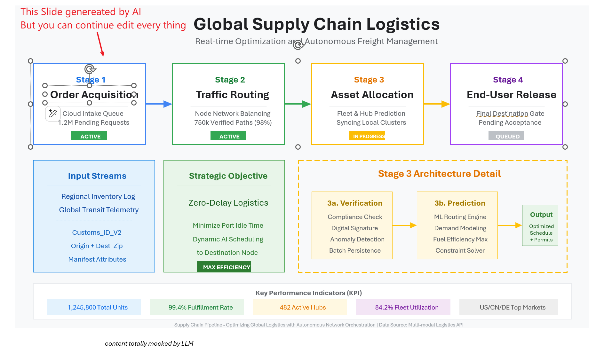
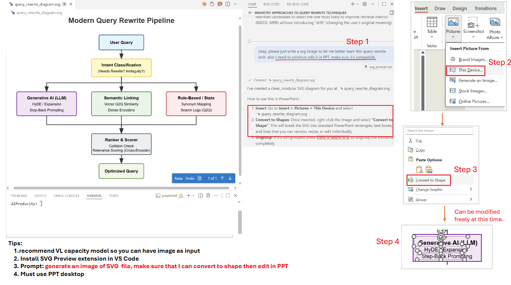
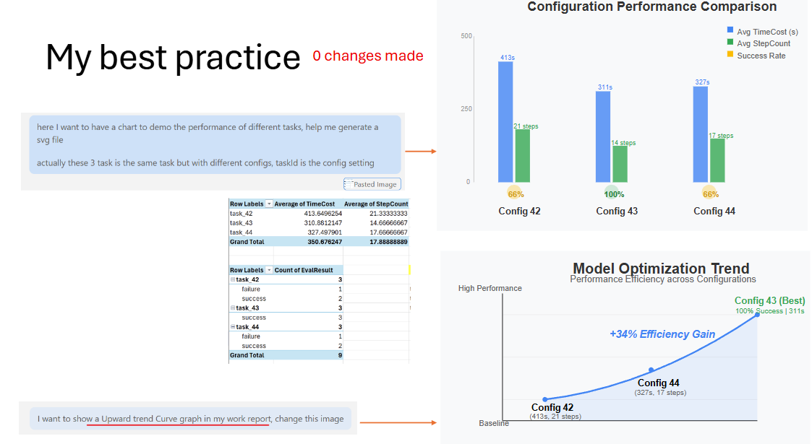
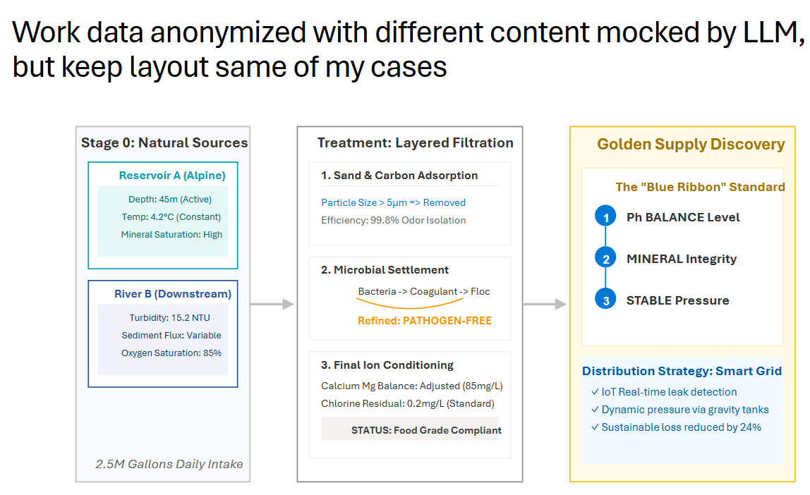
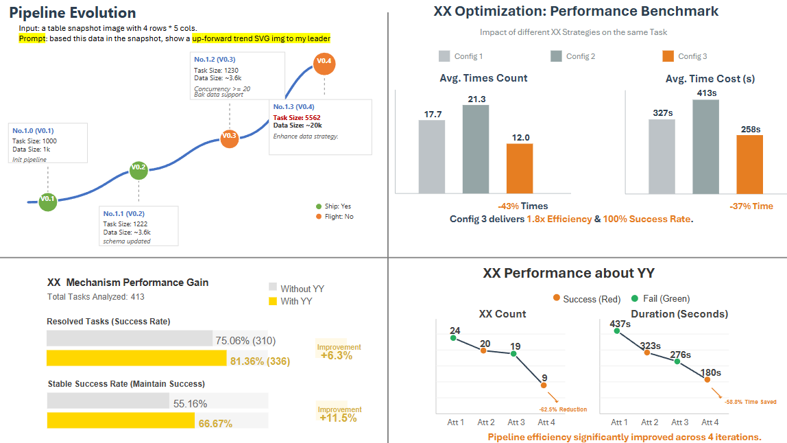
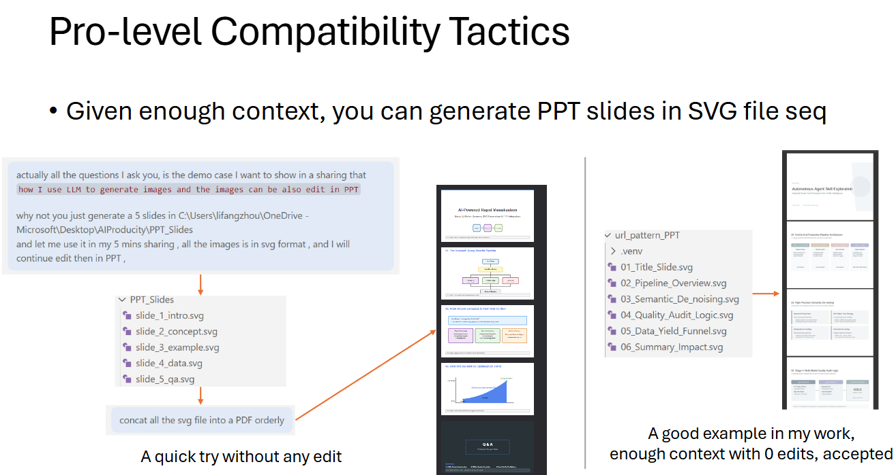

[English](README_en.md) | 中文

# AI PPT Editable

> **用 AI 生成可继续编辑的 PowerPoint。** 原生形状、文字、布局 —— 不是死图。专为职场汇报打造。

区别于直接把 AI 生成的图片贴进 PPT（死图，无法在 PPT 里继续编辑），本项目产出的图表导入 PowerPoint 后，**每一个元素都是可编辑的原生形状** —— 移动、改色、缩放都不受限。采用莫兰迪配色，打造麦肯锡/咨询级专业幻灯片。



> **技术原理：** 在与 LLM 的对话中，把本项目的 skill 作为上下文提供给 LLM，LLM 生成 SVG 文件 → 插入 PowerPoint → 右键「转换为形状」→ 后续在 PPT 中继续编辑。

> 📄 **完整演示与详解**：[USE LLM To Generate PPT Slides (PDF)](docs/USE_LLM_To_Generate_PPT_Slides.pdf)

## 核心特性

- **导入后可编辑** — 每个元素都是原生 PPT 形状，而非锁死的图片
- **PPT 安全 SVG 生成** — 严格规则保证 100% 成功导入
- **莫兰迪配色** — 低饱和、高级感配色方案，适合商业/科技/咨询报告
- **数据驱动布局** — 基于数据计算坐标，拒绝凭感觉估算
- **递归分组** — 阶梯式取消组合，高效编辑幻灯片

## 工作原理

从 prompt 到完全可编辑的幻灯片，只需 4 步：



1. **提示 LLM** 按本项目的 PPT 安全规则生成 SVG 图表
2. **插入 PowerPoint**：*插入 → 图片 → 此设备*，选择 `.svg`
3. **转换为形状**：右键图片 → *转换为形状*
4. **自由编辑**：每个框、箭头、文本都是原生 PPT 对象

## 多模态迭代

在多模态 LLM（Gemini 3、Claude 等）中，可以直接**粘贴截图**告诉 LLM 要改什么 —— 例如「这个箭头太大了」「按表格数据重画上升趋势图」，LLM 会直接返回修改后的 SVG：



## 示例

**莫兰迪风格多阶段流程图：**



**更多工作汇报场景** — 流程图、数据指标、架构图、时间线：



## 进阶：生成整套汇报

给足上下文后，可让 LLM 一次生成一整套 SVG 幻灯片，每页都可在 PPT 中继续编辑：



## 快速开始

### 作为 Claude Skill 使用

将 skill 目录复制到 Claude Code 的 skills 目录：

```bash
# 中文版
cp -r skills/svg-ppt-guide-zh ~/.claude/skills/

# English version
cp -r skills/svg-ppt-guide-en ~/.claude/skills/
```

然后在 Claude Code 中，用 `/svg-ppt-guide-zh` 或 `/svg-ppt-guide-en` 调用。

### 关键技术规则

| 规则 | 原因 |
|------|------|
| 禁用 `<marker>` 元素 | PPT 会将其渲染为方块或使其消失 |
| 使用 `<polygon>` 绘制箭头 | PPT 中三角形渲染可靠 |
| 线条端点穿入箭头 2-4px | 消除浮点舍入导致的白缝 |
| 容器宽度 = 文字 × 1.2 | 防止 PPT 字体膨胀后文字溢出 |
| 必须设置 `text-anchor: middle` | 确保文本居中在转换后保持 |
| 优先使用绝对坐标 | 提高"转换为形状"识别率 |

## 项目结构

```
ai-ppt-editable/
├── skills/
│   ├── svg-ppt-guide-zh/
│   │   └── SKILL.md           # Claude Skill（中文版）
│   └── svg-ppt-guide-en/
│       └── SKILL.md           # Claude Skill（English）
├── docs/
│   └── technical-reference.md  # 详细技术规格
├── examples/                   # SVG 示例输出
├── README.md               # 中文说明
├── README_en.md            # English README
├── LICENSE
└── .gitignore
```

## 路线图

- [x] 核心 SVG-to-PPT skill（Claude Code）
- [ ] 常见图表类型的 SVG 示例库
- [ ] 模板库（组织架构图、流程图、时间线、矩阵图）
- [ ] 自动化 PPT 生成流水线
- [ ] 基于结构化数据的多页幻灯片生成
- [ ] 工作汇报场景模板（周报/月报/季报）

## 使用场景

- **工作汇报** — 周报、项目状态、KPI 仪表板
- **技术架构** — 系统图、数据流、基础设施
- **咨询交付物** — 战略框架、流程图、矩阵分析
- **研究论文** — 方法论图示、结果可视化

## 贡献

欢迎提交 Issue 或 Pull Request！

## 许可证

[MIT](LICENSE)
