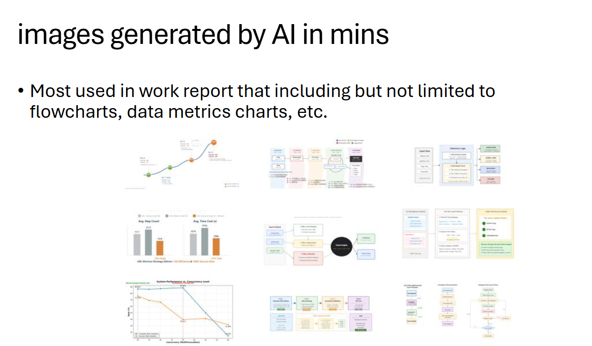

English | [中文](README.md)

# AI PPT Editable

> **Generate editable PowerPoint with AI.** Native shapes, text, and layouts — not flat images. Built for professional work reporting.

Unlike tools that paste AI-generated images into slides, this project produces diagrams that import into PowerPoint as **fully editable native shapes** — move, recolor, resize every element after import. Designed with Morandi color aesthetics for McKinsey/consulting-grade professional slides.


> **Under the hood:** AI generates SVG following PPT-safe rules, then PowerPoint's *Convert to Shape* turns every element into a native object.

## Features

- **Editable After Import** — every element becomes a native PPT shape, not a locked image
- **PPT-Safe SVG Generation** — strict rules ensure 100% successful import
- **Morandi Color Palette** — Low-saturation, sophisticated color schemes for professional reports
- **Data-Driven Layout** — Coordinate calculation from data, not guesswork
- **Recursive Grouping** — Stepped ungrouping for efficient slide editing

## How It Works

Four steps from prompt to a fully editable slide:


1. **Prompt** an LLM to generate an SVG diagram following the PPT-safe rules in this skill
2. **Insert** the `.svg` into PowerPoint via *Insert → Pictures → This Device*
3. **Convert to Shape** — right-click the image and select *Convert to Shape*
4. **Edit freely** — every box, arrow, and text label is now a native PPT object

## Examples

**Morandi-styled multi-stage diagram:**


**More work-report use cases** — flowcharts, data metrics, architectures, timelines:



## Advanced: Generate a Full Deck

With enough context, ask the LLM to generate an entire slide deck as a sequence of SVG files — each slide stays editable in PPT:


## Quick Start

### As a Claude Skill

Copy the skill directory into your Claude Code skills directory:

```bash
# English version
cp -r skills/svg-ppt-guide-en ~/.claude/skills/

# Chinese version
cp -r skills/svg-ppt-guide-zh ~/.claude/skills/
```

Then invoke in Claude Code via `/svg-ppt-guide-en` or `/svg-ppt-guide-zh`.

### Key Technical Rules

| Rule | Why |
|------|-----|
| No `<marker>` elements | PPT renders them as blocks or makes them disappear |
| Use `<polygon>` for arrows | Reliable triangle rendering in PPT |
| Line endpoints penetrate arrow 2-4px | Eliminates white gaps from float rounding |
| Container width = text × 1.2 | Prevents text overflow after PPT font expansion |
| `text-anchor: middle` required | Ensures centered text survives conversion |
| Absolute coordinates preferred | Better "Convert to Shape" recognition |

## Project Structure

```
ai-ppt-editable/
├── skills/
│   ├── svg-ppt-guide-zh/
│   │   └── SKILL.md           # Claude Skill (Chinese)
│   └── svg-ppt-guide-en/
│       └── SKILL.md           # Claude Skill (English)
├── docs/
│   └── technical-reference.md  # Detailed technical specs
├── examples/                   # Example SVG outputs
├── README.md               # 中文说明
├── README_en.md            # English README
├── LICENSE
└── .gitignore
```

## Roadmap

- [x] Core SVG-to-PPT skill (Claude Code)
- [ ] Example SVG gallery for common diagram types
- [ ] Template library (org charts, flowcharts, timelines, matrices)
- [ ] Automated PPT generation pipeline
- [ ] Multi-slide deck generation from structured data
- [ ] Work reporting scenario templates (weekly/monthly/quarterly)

## Use Cases

> 📄 For a detailed walkthrough, see [USE LLM To Generate PPT Slides (PDF)](docs/USE_LLM_To_Generate_PPT_Slides.pdf)

- **Work Reporting** — Weekly updates, project status, KPI dashboards
- **Technical Architecture** — System diagrams, data flow, infrastructure
- **Consulting Deliverables** — Strategy frameworks, process maps, matrices
- **Research Papers** — Method diagrams, result visualizations

## Contributing

Contributions are welcome! Please open an issue or submit a PR.

## License

[MIT](LICENSE)
